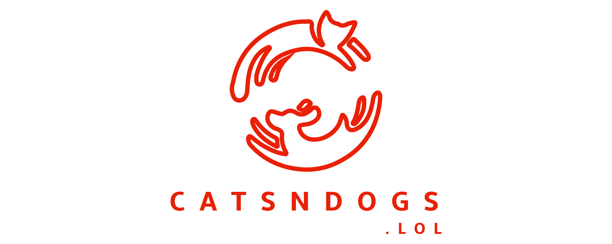

# Workshop overview
Welcome to catsndogs.lol, the fifth most highly rated cat and dog meme sharing website in Australia and New Zealand. Our mission is to serve a wide range quality of cat and dog memes to our customers. Memes come and go quickly, and we are starting to see larger and larger surges in customer demand.
catsndogs.lol uses Docker containers to host our application. Until today we’ve run everything on a spare laptop, but now we’re moving to the Amazon Elastic Container Service (ECS). Our DevOps Shepherd wants to take advantage of the latest and greatest features of the ECS platform. We also have several new initiatives that the developers and data science teams are keen to release.
As the new DevOps team, you will create the ECS environment, deploy the cats and dogs applications, cope with our hoped-for scaling issues, and enable the other teams to release new features to make our customers happier than ever.
**Welcome aboard!**

# Initial environment setup

### Prerequisites
This workshop requires:
- A laptop with Wi-Fi running Microsoft Windows, Mac OS X, or Linux.
- The AWSCLI installed.
- An Internet browser such as Chrome, Firefox, Safari, or Edge.
- An AWS account. You will create AWS resources including IAM roles during the workshop.
- An EC2 key pair created in the AWS region you are working in.

### Initial Setup
1.	Clone this repository to your local workspace. This contains the CloudFormation templates and other materials you will need during the workshop.

2.	If you do not already have an EC2 keypair created, sign-in to the AWS EC2 console at https://console.aws.amazon.com/ec2/
a.	Click Key Pairs and then click Create Key Pair.
b.	Give the key pair a name and click Create. The console will generate a new key pair and download the private key. Keep this somewhere safe.

2.	Deploy the initial CloudFormation template. This creates IAM roles, an S3 bucket, and other resources that you will use in later labs. The template is called `cfn-templates/Lab0-baseline-setup.yml` If you are sharing an AWS account with someone else doing the workshop, only one of you needs to create this stack.
In Stack name, enter **catsndogssetup**. Later labs will reference this stack by name, so if you choose a different stack name you will need to change the *LabSetupStackName* parameter in later labs.

3.	Be sure to tick the *I acknowledge that AWS CloudFormation might create IAM resources with custom names* check box.

### Where do you go from here?

| Labs |
| ------------- |
| [Cost management and EC2 scaling](Lab-1-Artifacts/) |
| [ECS Service deployment and task Auto Scaling](Lab-2-Artifacts/) |
| [Deploying a new version of the cats service with secrets management](Lab-3-Artifacts/) |
| [Running ECS tasks based on time and events](Lab-4-Artifacts/) |
| [Machine Learning containers and placement constraints](Lab-5-Artifacts/) |
| [Automated Deployments](Lab-6-Artifacts/) |
| [Advanced Deployment Techniques](Lab-7-Artifacts/) |
| [Clean up](Lab-99-Clean-up) |

## Detailed Instructions

Detailed instructions for all of the labs can be found [here](Docs/Docs/Container management at catsndogs.lol - detailed instructions.docx)

## Participation

We encourage participation; if you find anything, please submit an issue. However, if you want to help raise the bar, submit a PR!

## License

This library is licensed under the Apache 2.0 License.
